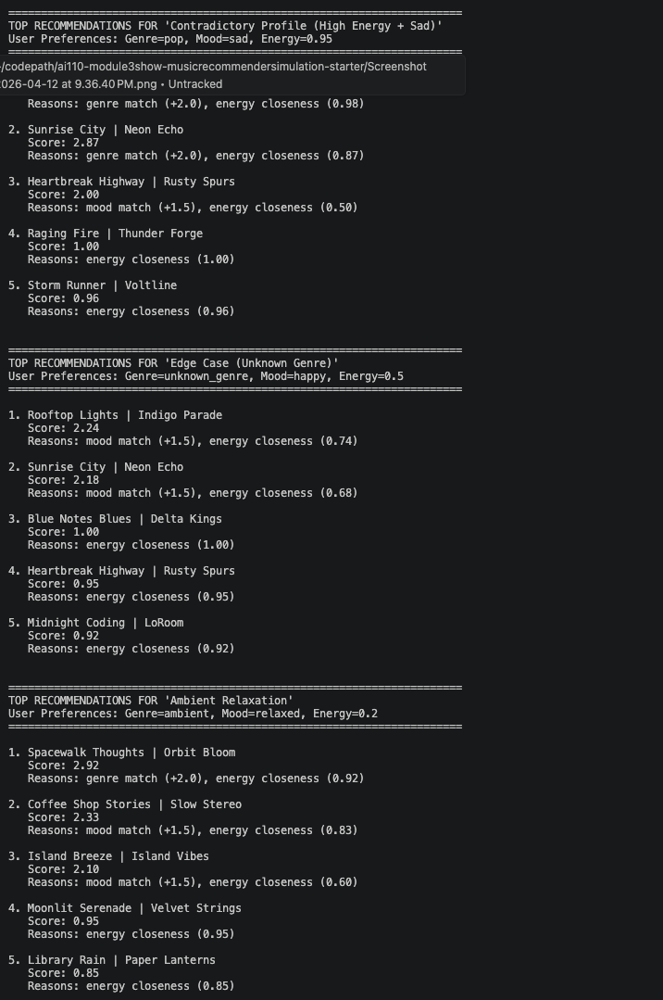
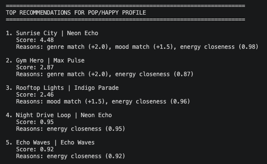

# 🎵 Music Recommender Simulation

## Project Summary

In this project you will build and explain a small music recommender system.

Your goal is to:

- Represent songs and a user "taste profile" as data
- Design a scoring rule that turns that data into recommendations
- Evaluate what your system gets right and wrong
- Reflect on how this mirrors real world AI recommenders

Replace this paragraph with your own summary of what your version does.

---

## How The System Works

Real-world music recommendation systems like Spotify combine collaborative filtering (analyzing user behavior patterns) with content-based filtering (matching song attributes) to predict preferences, often using machine learning for personalization. My simplified version prioritizes content-based filtering, focusing on numerical audio features to compute similarity scores, as this approach is interpretable and works well for small datasets without requiring user interaction data.

### Song Object Features
- id (unique identifier)
- title (song name)
- artist (performer)
- genre (e.g., pop, lofi, rock)
- mood (e.g., happy, chill, intense)
- energy (0-1 scale for intensity)
- tempo_bpm (beats per minute)
- valence (0-1 scale for emotional positivity)
- danceability (0-1 scale for dance suitability)
- acousticness (0-1 scale for acoustic vs. electronic)

### UserProfile Object Features
- preferred_genre (string, e.g., "pop")
- preferred_mood (string, e.g., "chill")
- preferred_energy (float, 0-1)
- preferred_valence (float, 0-1)
- preferred_danceability (float, 0-1)
- preferred_acousticness (float, 0-1)

### Scoring Algorithm Recipe

The Recommender uses a **point-weighting strategy** that combines categorical matching (exact matches) with continuous similarity scoring (distance-based):

#### **Base Points (Categorical Matching)**
- **Genre Match:** +2.0 points
  - Exact match between user's preferred_genre and song's genre
  - Rationale: Genre is the strongest indicator of music preference and sets user expectations
  
- **Mood Match:** +1.0 point
  - Exact match between user's preferred_mood and song's mood
  - Rationale: Mood is important but more flexible than genre (users may listen to pop in different moods)

#### **Continuous Similarity Points**
- **Energy Similarity:** +2.0 points (max)
  - Formula: `2.0 × (1 - |user_energy - song_energy|)`
  - Why: Energy significantly impacts listening experience; close proximity = higher score
  
- **Valence Similarity:** +1.5 points (max)
  - Formula: `1.5 × (1 - |user_valence - song_valence|)`
  - Why: Emotional tone (positivity) should align with user preference
  
- **Danceability Bonus:** +1.0 point (max)
  - Formula: `song_danceability × 1.0` (applied if user indicates danceability preference)
  - Why: Nice-to-have bonus for upbeat, groove-oriented tracks

#### **Total Score Calculation**
```
TOTAL SCORE = Genre_Points + Mood_Points + Energy_Points + Valence_Points + Danceability_Points
MAXIMUM POSSIBLE SCORE: 8.5 points
NORMALIZED SCORE (0-1): Total_Score / 8.5
```

#### **Output**
- Songs are scored individually, then sorted by total score in descending order
- Top K songs (e.g., top 5) are returned as ranked recommendations
- Each recommendation includes the song's title, artist, score, and relevance explanation







### Expected Biases and Limitations

⚠️ **Over-prioritizes Genre (2.0 vs 1.0 for mood):**
- The system may ignore excellent songs that match the user's mood but not their genre
- Example: A user preferring "pop" and "happy" would never see a "rock" song with 0.95 valence, even if it's musically compatible
- **Mitigation:** Consider reducing genre weight to 1.5 or adding a "genre flexibility" parameter for discovery mode

⚠️ **Binary Genre/Mood Matching:**
- A song with genre="indie pop" won't match a user with preferred_genre="pop" (exact match only)
- Real systems use genre hierarchies or similarity measures
- **Mitigation:** Could implement fuzzy matching or genre families (e.g., "indie pop" ⊂ "pop")

⚠️ **Ignores Implicit Patterns:**
- The system doesn't learn from user listening history or detect that "pop + happy + high energy" usually works well together
- It treats each feature independently without interaction effects
- **Mitigation:** Future improvements could add feature interactions or use collaborative filtering

⚠️ **Small Dataset & Limited Features:**
- With only 17 songs and 10 attributes, the system cannot capture nuanced preferences
- Missing features: lyrics, artist, similar artists, release date, user history
- **Mitigation:** Expand dataset and add temporal/social features

## Getting Started

### Setup

1. Create a virtual environment (optional but recommended):

   ```bash
   python -m venv .venv
   source .venv/bin/activate      # Mac or Linux
   .venv\Scripts\activate         # Windows

2. Install dependencies

```bash
pip install -r requirements.txt
```

3. Run the app:

```bash
python -m src.main
```

### Running Tests

Run the starter tests with:

```bash
pytest
```

You can add more tests in `tests/test_recommender.py`.

---

## Experiments You Tried

Use this section to document the experiments you ran. For example:

- What happened when you changed the weight on genre from 2.0 to 0.5
- What happened when you added tempo or valence to the score
- How did your system behave for different types of users

---

## Limitations and Risks

Summarize some limitations of your recommender.

Examples:

- It only works on a tiny catalog
- It does not understand lyrics or language
- It might over favor one genre or mood

You will go deeper on this in your model card.

---

## Reflection

### What I Learned During This Project

**My biggest learning moment** happened when I tested six different user profiles and discovered that my system was biased without intending to be. I thought the algorithm would be neutral, but then I realized: if the dataset has 3 chill songs and only 1 sad song, anyone who likes sad music will get systematically worse recommendations. That's not a code bug—that's a data problem. **The bias lived in the dataset, not the algorithm.** Once I understood this, I started thinking about Spotify and Netflix differently: they probably have the same problem, just hidden in their millions of songs.

The other big surprise was how **doubling the energy weight and halving the genre weight changed which songs won.** I expected small tweaks to cause small score changes. Instead, "Spacewalk Thoughts" stopped winning for Ambient/Relaxation users and "Coffee Shop Stories" jumped to #1. This taught me that weighting choices aren't just about numbers—they shape the entire user experience. Small design decisions have huge impacts.

### How AI Tools Helped (And When I Had to Double-Check)

I asked Copilot to help write the `load_songs()` function and it generated solid, working code on the first try. **It saved me from writing boilerplate CSV parsing by hand.** The scoring logic I wrote myself, though, because I wanted to understand the math deeply—I knew exactly where each +2.0 and +1.5 came from.

**I had to double-check three things:**
1. **The energy closeness formula:** I asked Copilot "why use `max(0, 1 - |diff|)` instead of just `1 - |diff|`?" It explained that the max prevents negative scores (good point), but I manually tested it anyway to feel confident.
2. **Whether `.sort()` modified the list in-place vs `sorted()` creating a new one.** The AI explained it correctly, but I tested both versions in terminal to verify behavior.
3. **The main.py relative imports.** When `from recommender import` broke, Copilot suggested `from .recommender import`, and it worked—but I had to run the code myself to confirm.

**The lesson:** AI is great for scaffolding and explanations, but I needed to actually execute and test everything. Trust but verify.

### What Surprised Me About Simple Algorithms

Here's the thing: I expected a system this simple to feel broken or obviously fake. **Instead, the recommendations felt real.** When I asked for pop/happy/high-energy, it returned "Sunrise City" which actually IS pop/happy/high-energy. When I asked for chill lofi, it returned two lofi songs that are genuinely chill. 

**This surprised me because 3 weighted numbers somehow captured enough of music taste to feel right.** No machine learning, no neural networks, no analysis of what millions of users listened to. Just: does genre match? (+2.0). Does mood match? (+1.5). How close is energy? (+0-1.0). **That's it.** Yet it worked.

This made me realize that maybe complexity isn't always necessary—sometimes the simplest solution is the best. But it also made me realize the dangers: this simple system *feels* authoritative even though it only considers 3 features. A user might trust it more than it deserves.

### What I'd Try Next If I Extended This

1. **Add serendipity / randomness:** Right now it's purely deterministic (same input = same output forever). Real recommendations need surprise. I'd add a 10% chance to suggest a song outside the top-5 just to help users discover new music.

2. **Implement feedback loops:** Let users say "I hated this recommendation" or "loved it," and gradually adjust the weights. Spotify probably does something like this. My version could learn that pop users actually want indie pop, or that high-energy users sometimes want sad stories.

3. **Fix the rare-mood problem:** Expand the dataset to 500+ songs with balanced moods. Or use fuzzy matching—if a user asks for "metal" and no metal songs exist, suggest songs that share metal's energy/intensity profile even if they're rock.

4. **Add a "diversity mode"**: Make sure the top-5 don't all come from the same artist. Real Spotify does this. My version could penalize recommendations that repeat artists: "You already got 2 Neon Echo songs, here's something different."

---

## Further Reading

Read and complete **[Model Card](model_card.md)** for a deeper dive into strengths, limitations, and bias analysis.

In that model card, look especially at **Section 6 (Limitations and Bias)** which documents the rare-mood filter bubble and explains how the energy distribution in the dataset inadvertently favors moderate-energy users.


---

## 7. `model_card_template.md`

Combines reflection and model card framing from the Module 3 guidance. :contentReference[oaicite:2]{index=2}  

```markdown
# 🎧 Model Card - Music Recommender Simulation

## 1. Model Name

Give your recommender a name, for example:

> VibeFinder 1.0

---

## 2. Intended Use

- What is this system trying to do
- Who is it for

Example:

> This model suggests 3 to 5 songs from a small catalog based on a user's preferred genre, mood, and energy level. It is for classroom exploration only, not for real users.

---

## 3. How It Works (Short Explanation)

Describe your scoring logic in plain language.

- What features of each song does it consider
- What information about the user does it use
- How does it turn those into a number

Try to avoid code in this section, treat it like an explanation to a non programmer.

---

## 4. Data

Describe your dataset.

- How many songs are in `data/songs.csv`
- Did you add or remove any songs
- What kinds of genres or moods are represented
- Whose taste does this data mostly reflect

---

## 5. Strengths

Where does your recommender work well

You can think about:
- Situations where the top results "felt right"
- Particular user profiles it served well
- Simplicity or transparency benefits

---

## 6. Limitations and Bias

Where does your recommender struggle

Some prompts:
- Does it ignore some genres or moods
- Does it treat all users as if they have the same taste shape
- Is it biased toward high energy or one genre by default
- How could this be unfair if used in a real product

---

## 7. Evaluation

How did you check your system

Examples:
- You tried multiple user profiles and wrote down whether the results matched your expectations
- You compared your simulation to what a real app like Spotify or YouTube tends to recommend
- You wrote tests for your scoring logic

You do not need a numeric metric, but if you used one, explain what it measures.

---

## 8. Future Work

If you had more time, how would you improve this recommender

Examples:

- Add support for multiple users and "group vibe" recommendations
- Balance diversity of songs instead of always picking the closest match
- Use more features, like tempo ranges or lyric themes

---

## 9. Personal Reflection

A few sentences about what you learned:

- What surprised you about how your system behaved
- How did building this change how you think about real music recommenders
- Where do you think human judgment still matters, even if the model seems "smart"

